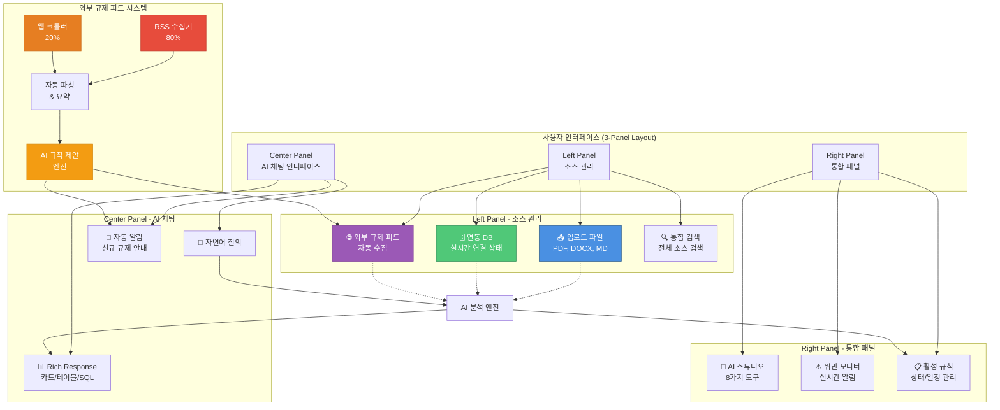
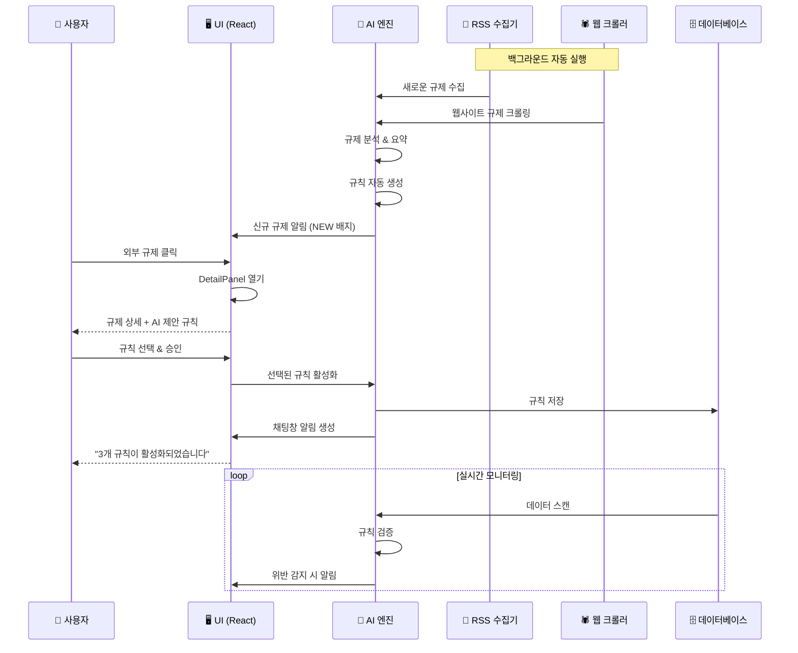
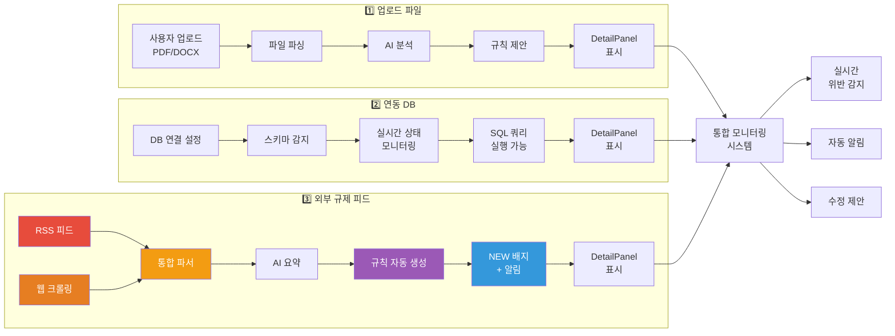
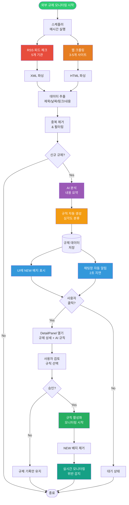
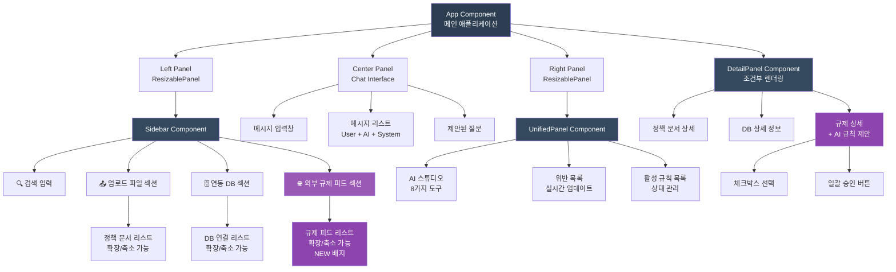
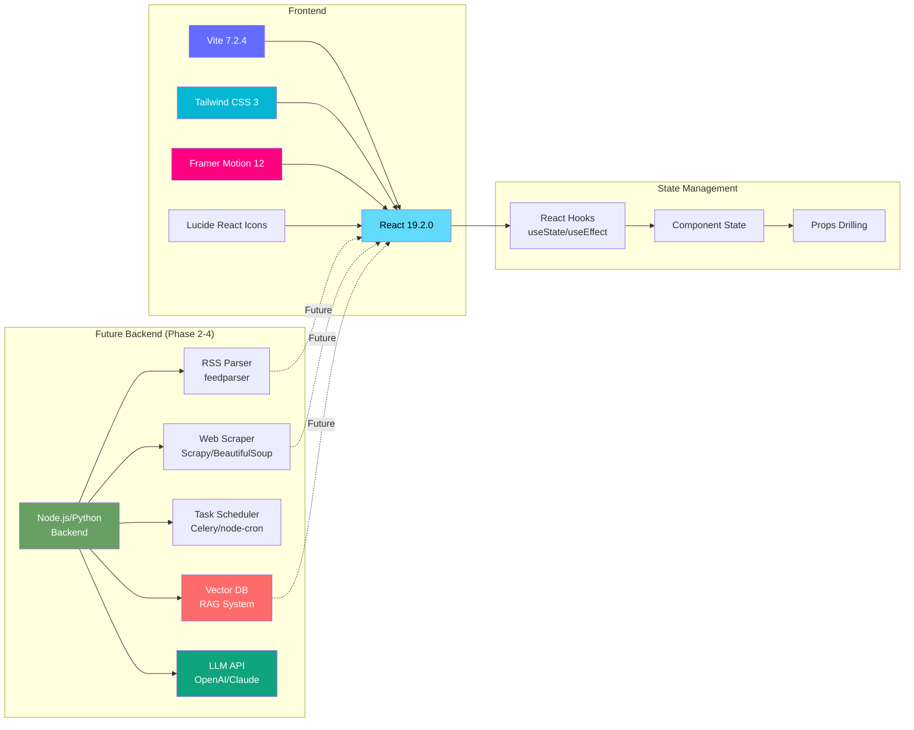

# RuleX System Architecture

## 시스템 전체 구조도



## 데이터 흐름도



## 소스별 상세 흐름



## 외부 규제 피드 상세 프로세스



## 컴포넌트 계층 구조



## 기술 스택



## 주요 데이터 구조

### 외부 규제 데이터 구조
```javascript
{
  id: "reg-001",
  title: "금융소비자보호법 시행령 개정안",
  source: "금융위원회",
  date: "2024-11-15",
  url: "https://fsc.go.kr/...",
  isNew: true,
  summary: "금융상품 판매 시 사전 설명 의무 강화...",
  suggestedRules: [
    {
      name: "금융상품 설명 미이행 감지",
      severity: "high",
      description: "상품 판매 전 설명 의무 준수 확인",
      query: "SELECT * FROM sales WHERE explanation_completed = false"
    }
  ]
}
```

### 규칙 데이터 구조
```javascript
{
  id: "rule-001",
  name: "90일 비밀번호 미변경 감지",
  policy: "정보보호 정책 v3.0",
  policyId: "policy-001",
  dataSource: "HR_System",
  status: "active",
  schedule: "매일 09:00",
  violations: 5,
  severity: "high",
  notification: true,
  query: "SELECT * FROM users WHERE password_changed_date < DATE_SUB(NOW(), INTERVAL 90 DAY)",
  lastRun: "2024-11-15 09:00:00",
  description: "90일 이상 비밀번호를 변경하지 않은 계정 탐지"
}
```

## 향후 로드맵

### Phase 1: UI/UX 구현 ✅ COMPLETE
- 3-Panel 레이아웃
- 소스 관리 (업로드 파일, 연동 DB, 외부 규제 피드)
- AI 채팅 인터페이스
- DetailPanel 시스템
- 검색 및 필터링
- 확장/축소 애니메이션

### Phase 2: 백엔드 RSS 수집 🔄 IN PROGRESS
- RSS 피드 파서 구현
- 5개 규제 기관 연동
- 스케줄러 설정 (매시간)
- MongoDB 데이터 저장

### Phase 3: 웹 크롤링 📅 PLANNED
- Scrapy/BeautifulSoup 구현
- 3-5개 타겟 사이트
- 에러 핸들링 및 재시도 로직
- 크롤러 상태 모니터링

### Phase 4: AI/RAG 통합 📅 PLANNED
- Vector DB 구축
- 규제 임베딩 생성
- LLM 프롬프트 엔지니어링
- 규칙 자동 생성 고도화
- Diff 분석 (규제 변경사항)

---

**문서 작성일**: 2024-12-19  
**버전**: 2.0  
**작성자**: RuleX Development Team
